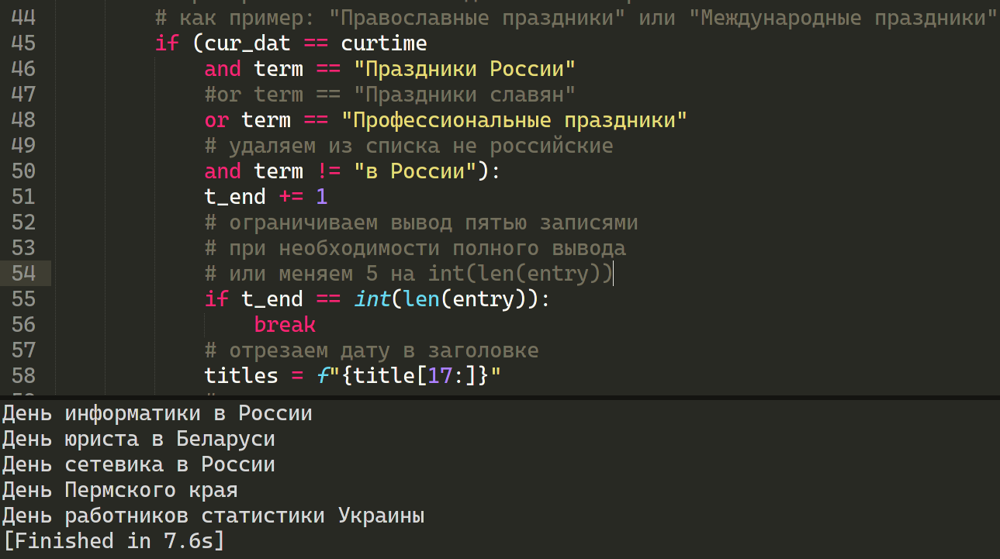
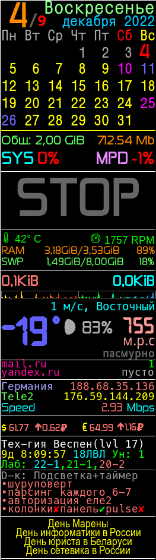

# Список праздников для conky

Небольшое доплонение для conky, показывающее сегодняшние праздники


### Зависимости:

1. [feedparser](https://github.com/kurtmckee/feedparser/)
2. [pathlib](https://github.com/jazzband/pathlib2/)

### Установка:

```bash
mkdir $USER/conky
cd $USER/conky
git clone https://github.com/delvin-fil/cal-for-conky
cd ~
vim ~/.conkytc
```

в теле добавляем:

```lua
conky.text = [[
...
${catp /tmp/holidays.txt}
...
]]
```

При необходимости изменить вывод правим код:


### Скриншот полной версии:



###### P.S: Обошелся без проверок, ибо написано было за 5 минут "для внутреннего использования"
